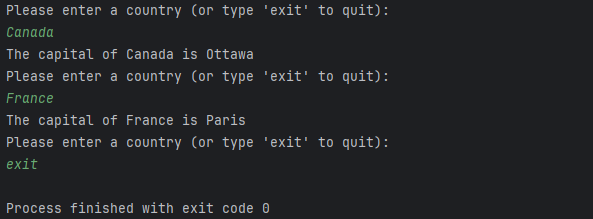

# Country Capital Lookup System

### Author: Rudolf Sirbu
**Date**: May 27, 2024

---

## Overview

The **Country Capital Lookup System** is a Java-based command-line application that allows users to retrieve the capital city of a given country.  
The system comes preloaded with popular country-capital pairs and supports loading additional data from an external file (`KeyValue.txt`).

---

## Features

- **Default Country-Capital Data**:
    - Preloaded with commonly known countries and their capitals (e.g., USA → Washington, D.C.).
- **File Support**:
    - Load additional country-capital pairs from a file for customization.
- **Case-Insensitive Search**:
    - Query countries without worrying about capitalization.
- **Interactive CLI**:
    - User-friendly command-line interface for entering country names and viewing results.

---

## How It Works

1. The program initializes with a set of default country-capital pairs.
2. It optionally loads additional data from a file named `KeyValue.txt`, if available.
3. Users are prompted to enter the name of a country and are shown its capital.
4. Type `exit` to terminate the program.

---

## Prerequisites

- **Java 8** or higher installed.
- (Optional) A file named `KeyValue.txt` in the same directory as the program.

### File Format for `KeyValue.txt`
The file should contain one country-capital pair per line, separated by a comma:

--- 

## Sample images of output
  

---

## Future Enhancements

- Add functionality to save new country-capital pairs entered during the session back to `KeyValue.txt`.
- Improve error handling for invalid input or file formatting.
- Develop a graphical user interface (GUI) for easier use.

